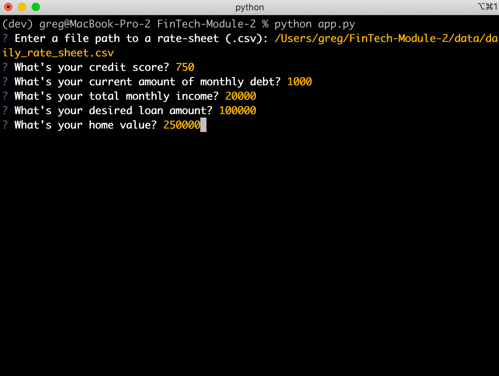
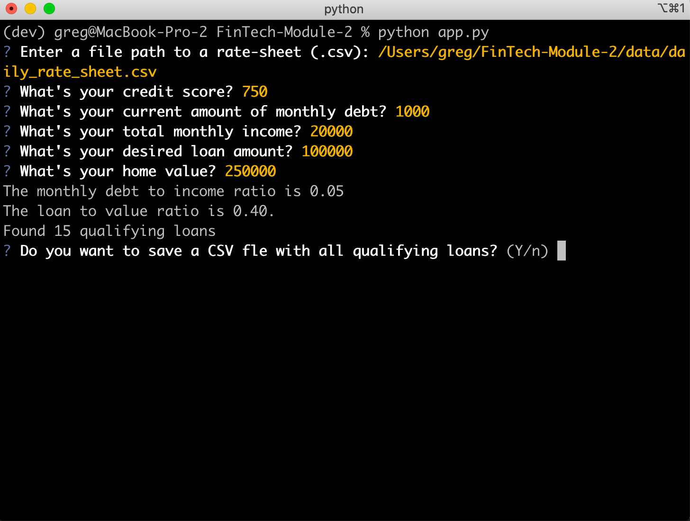
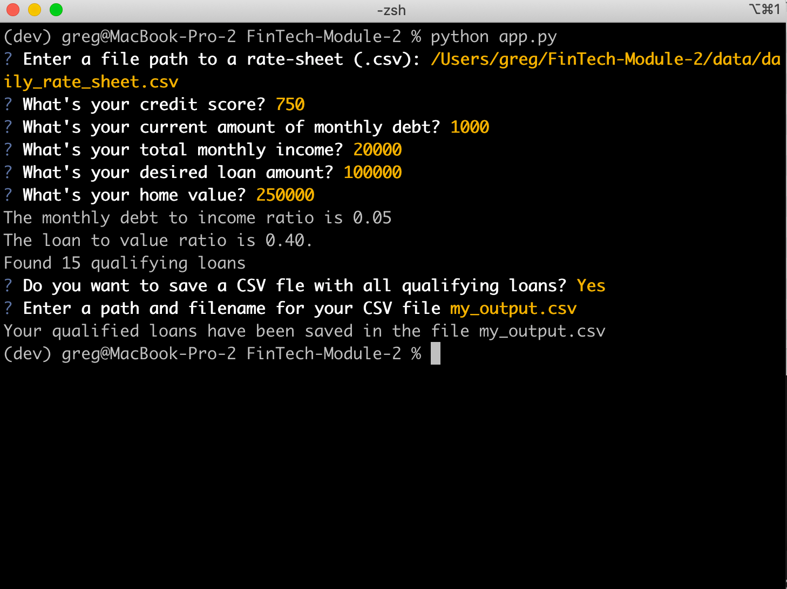

# *FinTech Repository -- Module 2 Challenge Submission*

This project is the Module 2 Challenge submission for the FinTech bootcamp program. Specifically, it adds new features and enhancements to the loan qualifier application. It also addresses the following:

* Version Control
* Software Requirements
* System Design
* Code Organization
* Usability
* Documentation

---

## Technologies

The technologies used for this project include:

* Python interpreter v3.9.12
* Python sys library: Support for system-specific parameters and functions
* Python fire library: Support for automatically generating command line interfaces (CLIs)
* Python questionary library: Support for building pretty command line interfaces
* Python pathlib library: Support for Object-oriented filesystem paths
* Python csv library: Support for CSV file reading and writing

---

## Installation Guide

Before running the application first install the following dependencies.

```python
  pip install fire
  pip install questionary
```

---

## Usage

To use the loan qualifier application simply clone the repository and run the **app.py**

```python
python app.py
```

Upon launching the application, you will be asked to input your credit rating, monthly recurring debt, monthly income, loan amount requested, and home valuation.



You will then be asked whether you want the qualified loans to be saved as a CSV file. If so, enter "Y" -- or press enter (the default is Yes).



If you answered Yes to output your results, you will then be asked to enter a path and/or filename for your results file. e.g. my_output.csv



---

---

## Contributors

Brought to you by Greg Richardson.

---

## License

The source code for the application is licensed under the MIT license, which you can find in the LICENSE file in this repo.
